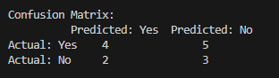
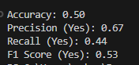

# K-Nearest-Neighborhood
## Overview
This repository contains an implementation of the K-Nearest Neighbor (k-NN) algorithm in Python. The project demonstrates the application of k-NN for classification tasks, including preprocessing data, handling categorical features, and evaluating the model using Leave-One-Out Cross-Validation (LOOCV).

## Features
Data Encoding: Automatic one-hot encoding for categorical features.
Custom Distance Metrics: Choose between Euclidean and Manhattan distances.
User Input: Interactive prompts for selecting hyperparameters (k and distance metric).
LOOCV Evaluation: Comprehensive validation of model accuracy using LOOCV.
Performance Metrics: Includes accuracy, precision, recall, F1 score, and confusion matrix.
Model Persistence: Saves the trained model as a JSON file for reproducibility.

## Requirements
The following libraries are required to run the script:

Python 3.x
pandas
numpy
json
To install the required libraries, use:
pip install pandas numpy

## Usage
### Prepare the Dataset
Ensure the dataset file (play_tennis.csv) is in the same directory as the script. The file should be in CSV format with ; as the delimiter.

### Run the Script
Execute the script with:

python knn.py

Input Hyperparameters
During execution, the script will prompt you to:

Enter the value of k (number of neighbors).
Choose the distance metric (Euclidean or Manhattan).
View Results
The script will:

Display encoded data, predictions, and performance metrics.
Output the confusion matrix, accuracy, precision, recall, and F1 score.
Save the Model
The trained model, along with its parameters, will be saved to knn_model.json.

## File Structure
knn.py: Main script implementing the k-NN classifier.
play_tennis.csv: Example dataset used for testing the implementation.
knn_model.json: Saved model output after execution.
Sample Output
Confusion Matrix

## How It Works
Data Preprocessing:
The script automatically encodes categorical features and separates features (X) from output labels (y).
Distance Calculation:
Computes the distance from the test instance to all training samples using the selected metric.
Classification:
Determines the majority class among the nearest k neighbors.
Validation:
LOOCV ensures each data point is tested once, providing an unbiased accuracy estimate.
Future Improvements
Add support for weighted k-NN.
Optimize distance calculations for larger datasets.
Implement cross-validation with different train-test splits.
## References
Python Official Documentation: https://docs.python.org
Scikit-learn Documentation: https://scikit-learn.org